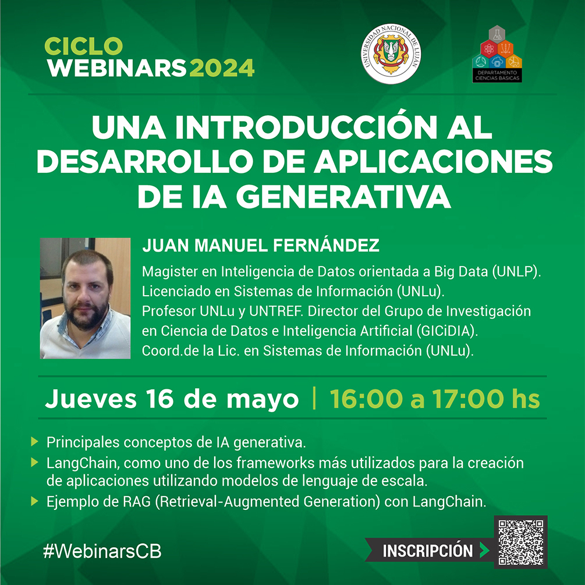

# Webinar: "Una introducción al desarrollo de aplicaciones de Inteligencia Artificial generativa"

En este repositorio se comparten recursos del Webinar, desarrollado en el marco del Ciclo de Webinars 2024 del Departamento de Ciencias Básicas de la Universidad Nacional de Luján.

  

