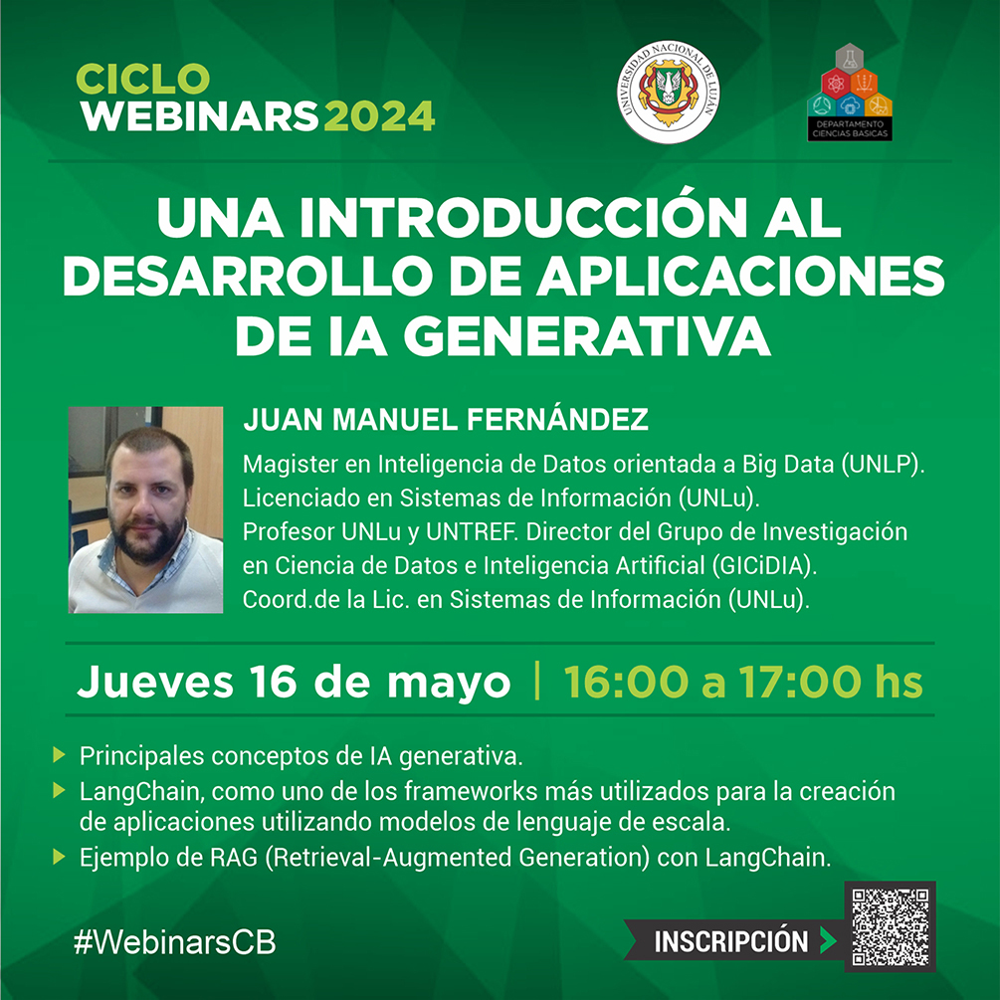
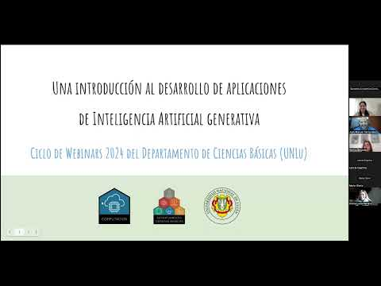

# Webinar: "Una introducción al desarrollo de aplicaciones de Inteligencia Artificial generativa"

En este repositorio se comparten recursos del Webinar, desarrollado en el marco del Ciclo de Webinars 2024 del Departamento de Ciencias Básicas de la Universidad Nacional de Luján.

  

A su vez, se comparte el video del Webinar (para acceder se debe hacer click en la imagen):

  

Por último, se incorpora la presentación que guió la disertación: [Enlace a la Presentación](https://docs.google.com/presentation/d/18_RQFECCihGLmPrIurvsUEASGXzE8u4vv0DjqSF5nko/edit?usp=sharing).
